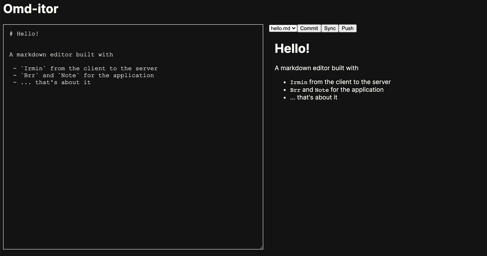

# Omditor

*Status: WIP & Experimental & PoC*

Omditor is a incredibly simple markdown editor that uses [Omd][omd] for the preview and [Irmin][irmin] for the client-server storage. Omditor is offline-first meaning even without a connection you can use the application to edit your markdown and later use Irmin to sync and push your changes. Thanks to Irmin's mergeable and branchable structure we get a collaborative, offline-first web application almost for free.

What follows is an explanation of this repository, bare in mind this is all proof-of-concept not some production service.

## What's Included?

This is a very simple markdown editor with everything written in OCaml. It provides a git-like interface to staging changes to a set of predefined files. Given time constraints there's lots of missing functionality like adding files, having hierarchical file structure, adding a proper code editor not just a `contenteditable` div etc.

## How it works?

The client uses [Js_of_ocaml][jsoo] and [brr + note][brr] (my first foray into *functional reactive programming*). The server uses [cohttp][cohttp] and [crunches][crunch] the Javascript to be served. **Everything** uses [irmin][irmin].

### Server

The server has two main roles: to serve the web applications and to provide the HTTP endpoint for the [irmin][irmin] stores to communicate. Before doing that it first sets up a Unix, git, key-value store. 

<!-- $MDX file=src/server/main.ml,part=0 -->
```ocaml
module Store = Irmin_unix.Git.FS.KV (Irmin.Contents.String)
module Sync = Irmin.Sync (Store)
module Http = Irmin_http.Server (Cohttp_lwt_unix.Server) (Store)
```

Layered over this store is the HTTP server endpoint. To combine this with an existing server I've had to do a bit of Irmin hacking to expose the callback rather than the [cohttp][cohttp] server (hence [irmin][irmin] is submoduled). I don't think it is possible to combine two cohttp servers once they are set up (I could be wrong). With the callback in hand we can set up the whole server callback which includes sending the web app down the line. 

<!-- $MDX file=src/server/main.ml,part=3 -->
```ocaml
let callback repo conn req body =
  let uri = Cohttp.Request.resource req in
  match uri with
  | "" | "/" | "/index.html" ->
      Server.respond_string ~status:`OK ~body:Html.html ()
  | "/static/index.js" ->
      Server.respond_string ~status:`OK
        ~body:(Assets.read "index.js" |> Option.get)
        ()
  | _irmin_path -> Http.callback repo conn req body
```

Whilst we're at it we can also pre-populate the [irmin][irmin] store with some contrived data. 

<!-- $MDX file=src/server/main.ml,part=2 -->
```ocaml
let store () =
  let config = Irmin_git.config ~bare:true repo in
  let* repo = Store.Repo.v config in
  let* t = Store.master repo in
  let* () = Store.set_exn ~info:(info "commit 1") t [ "hello.md" ] "# Hello!" in
  let* () = Store.set_exn ~info:(info "commit 2") t [ "salut.md" ] "# Salut!" in
  let+ () = Store.set_exn ~info:(info "commit 3") t [ "hola.md" ] "# Hola!" in
  repo
```

And finally we run the server at `http://localhost:8080`. 

<!-- $MDX file=src/server/main.ml,part=4 -->
```ocaml
let serve repo = Server.create (Server.make ~callback:(callback repo) ())

let main () =
  let* repo = store () in
  serve repo

let () = Lwt_main.run @@ main ()
```

### Client 

#### Overview

The client is quite a bit more complicated for two main reasons:

 1. The [irmin][irmin] store is now dealing with a local view of the data and also trying to synchronise and merge updates from the server.
 2. The application is reactive so it is built with [brr and note][brr].

The idea is fairly simple however. We want to have a local, persistent store where we can make changes, commit them and return to them later. At some point we want to then push these changes up to the server and also sync with whatever is up there.

For the sake of making this PoC simple and as short as possible, we're using `Irmin.Contents.String` which has the `idempotent` default merging tactic. A future version would do something cleverer over the `Omd` abstract syntax tree (I made a start of this [on this branch](https://github.com/patricoferris/omditor/tree/omd-repr) but it needed to extend `repr` and also we need an `Omd.doc -> string` function for the client, [turns out that's pretty challenging](https://github.com/patricoferris/omd/tree/omd-print))

#### Store

The first thing we need is a git-store, backed by the browser's IndexedDB. With the right functor magic this is straightforward enough. 

<!-- $MDX file=src/client/store.ml,part=1 -->
```ocaml
module Store =
  Irmin_git.Generic
    (Irmin_indexeddb.Content_store)
    (Irmin_indexeddb.Branch_store)
    (Irmin.Contents.String)
    (Irmin.Path.String_list)
    (Irmin.Branch.String)
```

Now we need to create the http client to get the remote information. You might be wondering why we need to do this? Irmin (more specifically ocaml-git) doesn't support bing a [git server just yet](https://github.com/mirage/ocaml-git/issues/15) so we can't actually pull from it. In the future when this is implemented it will reduce the complexity and amount of data used in this approach by requiring only two stores.

<!-- $MDX file=src/client/store.ml,part=2 -->
```ocaml
(* No ocaml-git server... so using HTTP remote... *)
module Remote = Irmin_http.Client (Client) (Store)
module Sync = Irmin.Sync (Store)
```

From there we can then implement a `sync` function which fetches the main branch from the server for the client and optionally merges this branch into the staging branch. The staging branch is where we do the local work until we are ready to push things to the server. We're using [irmin's][irmin] built-in `Irmin.remote_store` functionality along with the `Http` store to make this possible.

<!-- $MDX file=src/client/store.ml,part=4 -->
```ocaml
let sync ?(merge = true) t =
  let config = Irmin_http.config t.uri in
  let main = t.main in
  Remote.Repo.v config >>= fun repo ->
  Remote.master repo >>= fun remote ->
  Sync.pull_exn main ~depth:1 (Irmin.remote_store (module Remote) remote) `Set
  >>= fun _ ->
  if merge then (
    Brr.Console.log [ Jstr.v "Merging" ];
    Store.merge_into ~info:(info "update staging") ~into:t.staging main >>= function
      | Ok () -> Lwt.return @@ Ok ()
      | Error (`Conflict s) -> 
        (* Of course in practice we'd be more clever here... *)
        Store.Head.get main >>= fun head -> 
        Lwt_result.ok @@ Store.Branch.set (Store.repo t.staging) "staging" head
  )
  else Lwt_result.return ()
```

As the code makes clear, we're not doing anything particularly smart if we encounter a merge conflict. A common example of when this will occur is when we have to clients `A` and `B`.

 1. `A` makes some changes and hits the `commit` button so they are now locally committed to `staging`.
 2. `B` makes some changes and hits the `commit` button so they are now locally committed to `staging`.
 3. `A` is happy with their changes and hits `push` to put them on the server.
 4. `B` wants the latest things so hits `sync` which fetches the main branch with no problem, but when trying to merge into `staging`... 

As mentioned, a cleverer merging strategy either based on a diffing algorithm or the Omd AST would be a better choice here.

The `push` and `init` functions are fairly similar. The `init` function tries to look to see if there are fresh commits on the main branch so `staging` is behind and the idea would be to let the client know (this functionality is not implemented yet).

#### Application



I won't go into too much detail of the client-side reactive code because I'm not terribly confident with FRP just yet, but the basic idea is that the client has some model of data and you define actions that move the model from one state to another. The "HTML" is built on top of this model (but as a *signal*) so when something changes the relevant parts are re-rendered.

The model is pretty simple here: the current `file`, a list of possible `files` and the text being edited. The actions we can take are when there's an update to the text (the `bool` is whether we update the `contenteditable` div which we only do on a page load to or file change). A local commit, push, sync and file change should all be fairly understandable.

<!-- $MDX file=src/client/index.ml,part=0 -->
```ocaml
(* Model *)
type t = { file : string; files : string list; editor : Jstr.t }

type action =
  [ `Update of bool * Jstr.t
  | `LocalCommit
  | `Push
  | `Sync
  | `ChangeFile of string ]
```

If we have a look at one example, the `ChangeFile` action: 

<!-- $MDX file=src/client/index.ml,part=2 -->
```ocaml
let change_file store s t =
  let open Lwt.Infix in
  let f = { t with file = s } in
  Lwt_js_events.async (fun () ->
      Store.local_get store [ s ] >|= fun l ->
      refresh_send (`Update (true, Jstr.v l)));
  f
```

You can see we have a local in the store for the file we're after and then asynchronously fire a new update event. The event (and event sender `refresh_send`) are global and I have a feeling this might be a bit of an anti-pattern... but it works! 

One thing we do before changing files is to commit the content locally so we don't lose the work:

<!-- $MDX file=src/client/index.ml,part=3 -->
```ocaml
let reducer (store : Store.t) (action : [> action ]) =
  match action with
  | `Update s -> update s
  | `LocalCommit -> commit store
  | `Push -> push store
  | `Sync -> sync store
  (* Changing the file first locally commits it so you don't lose your changes! *)
  | `ChangeFile file -> fun t -> change_file store file (commit store t)
  | `UpdateEditable -> update_editable
```

I'm not sure if there are race-conditions with `Lwt_js_events.async`, I haven't experienced them yet but may be worth looking into.

The rest of the code is just for the UI and connecting up the different events, signal and elements.

### Extensions

 - As already mentioned a better merging strategy would unleash the full power of [irmin][irmin] and this approach to building web applications.
 - Making the app into a PWA would also make it truly offline-first.
 - The UX is not great, the buttons to provide any feedback, there's no way to toggle between your local content and what's on the server, or diff these two. That would be quite a nice experience.
 - Could you do peer-to-peer connections rather than relying directly on the server?
 - Better UI, writing bindings for CodeMirror shouldn't be too hard and would be better than a `contenteditable` `<div>`...
 - Full file hierarchy and file creation too, right now you only get the three files at the start.
 - An example where the initial git store is pulled from somewhere (e.g. Github) and periodically pushes the changes from the server back to there.

[irmin]: https://github.com/mirage/irmin
[cohttp]: https://github.com/mirage/ocaml-cohttp
[brr]: https://erratique.ch/software/brr
[jsoo]: https://github.com/ocsigen/js_of_ocaml
[omd]: https://github.com/ocaml/omd
[crunch]: https://github.com/mirage/ocaml-crunch
